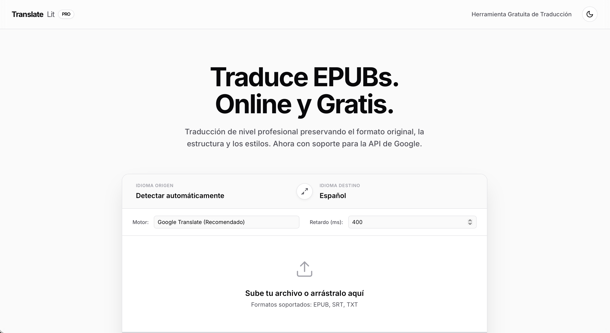

# TranslateLit — Traductor de EPUB & SRT

> Traducción de nivel profesional directamente en el navegador. Sin instalaciones, sin servidores, 100% gratis.




---

## Qué hace

TranslateLit es una herramienta web que traduce archivos **EPUB**, **SRT** y **TXT** preservando el formato original, la estructura y los estilos del documento. Todo el procesamiento ocurre en el navegador — ningún archivo sale de tu dispositivo.

## Características

- **EPUB completo** — respeta el orden del spine del OPF, mantiene el HTML/CSS intacto
- **SRT (subtítulos)** — traduce cada bloque respetando los timestamps
- **TXT** — fragmentación inteligente por oraciones para evitar cortes abruptos
- **3 motores de traducción** — Google Translate (recomendado), MyMemory, Lingva
- **Vista paralela** — previsualización original vs. traducido en tiempo real
- **Modo claro / oscuro** — con persistencia en localStorage
- **Drag & drop** — arrastra el archivo o haz clic para seleccionarlo
- **Retry automático** — reintentos con backoff exponencial ante errores de red
- **Sin backend** — cero dependencias de servidor, cero datos enviados a terceros

## Motores disponibles

| Motor | Límite por chunk | Notas |
|---|---|---|
| Google Translate | 1200 caracteres | Más preciso, recomendado |
| MyMemory | 400 caracteres | Alternativa gratuita con cuota diaria |
| Lingva | 400 caracteres | Open-source, sin cuota |

## Uso

1. Abre `index.html` en cualquier navegador moderno (o usa el [live demo](https://jolsck.github.io/TraductorEPUB))
2. Selecciona idioma de origen y destino
3. Elige el motor de traducción y el retardo entre peticiones
4. Sube tu archivo EPUB, SRT o TXT
5. Haz clic en **Iniciar Traducción**
6. Descarga el archivo traducido cuando llegue al 100%

## Stack técnico

- HTML + CSS + JavaScript vanilla — sin frameworks
- [JSZip](https://stuk.github.io/jszip/) para lectura/escritura de EPUB
- [HLS.js](https://github.com/video-dev/hls.js/) para el fondo de video
- Google Fonts (Inter + JetBrains Mono)
- APIs públicas de traducción (no requieren API key)

## Estructura del proyecto

```
TraductorEPUB/
├── index.html          # App principal (single-file)
├── assets/
│   └── preview.png     # Captura de pantalla para el README
└── README.md
```

## Limitaciones conocidas

- EPUBs con DRM no pueden ser procesados
- Los motores gratuitos tienen cuotas diarias — para libros largos, aumenta el retardo a 600–800 ms
- La detección automática de idioma depende del motor seleccionado

## Licencia

MIT — úsalo, modifícalo y distribúyelo libremente.

---

Made by [@jolsck](https://github.com/jolsck)
